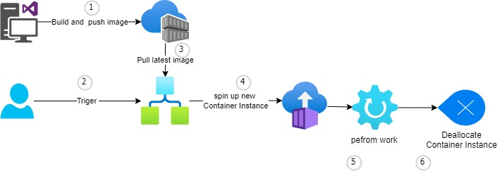

# Running .net console application on Azure container instance 

We sometimes have the need to use a console application to perform some computational tasks. Sometimes these tasks are run on a schedule that's weekly or less often.   I would like to run these processors on serverless cloud infrastructure so that you are only billed when service is utilized.

Below I have described my experiment on how I tried to achieve this objective using Docker, Azure Container Instances service, and Azure Logic Apps.

### High-level process overview


*High-level steps*

1. [Create console app](#create-console-app)
2. [Add docker support](#add-docker-support)
3. [Setup Azure infrastructure](#setup-azure-infrastructure)
4. [Build and load image to registry](#build-and-load-image-to-registry)
5. Trigger logic app


## Experiment 

### Prerequisites 
* [Docker Desktop](https://www.docker.com/products/docker-desktop/) 
* [.NET SDK](https://dotnet.microsoft.com/en-us/download/visual-studio-sdks)
* [VS.Code](https://code.visualstudio.com)
* (Optional) VS Code extensions 
  * C# v1.25.2
  * Docker v1.23.2
  * vscode-icons v12.0.1
  * YAML v1.10.1

### Create console app
1. Create .net application using vs code

*Get supported project templates*
```shell
dotnet new 
```
*Create new console project (and configure git repo)*
```shell
# dotnet new <short name> -n <project name> -o <project folder>
dotnet new console -n helloConsole -o App
cd App
dotnet new gitignore
git init
```
*Open project in vs code*
```shell
code .
```
2. Update code (Program.cs) to crate sample application that takes value from environment variable 
``` cSharp
Console.WriteLine("Start long running app");

var counter = 0;
var maxCount = Environment.GetEnvironmentVariable("max_count");
var max = string.IsNullOrEmpty(maxCount) ?-1: Convert.ToInt32(maxCount);
while (max == -1 || counter < max)
{
    Console.WriteLine($"Counter: {++counter}");
    await Task.Delay(TimeSpan.FromMilliseconds(1_000));
}

Console.WriteLine("End long running app");
```
3. Add debugging files 
   * "Run and Debug" extension >> "create a launch.json file > .NET 5+ and .NET Core"

   * "Run and Debug" extension >> .NET Core Launch 

### Add docker support
1. Add docker support using docker extension 
   * Ctrl+Shift+P >> Add docker file..
  
   * Select project type 
   * Select OS 
   * No docker compose (single service) 

   * Docker file is created 

Docker file 
```yaml
FROM mcr.microsoft.com/dotnet/runtime:7.0 AS base
WORKDIR /app

# Creates a non-root user with an explicit UID and adds permission to access the /app folder
# For more info, please refer to https://aka.ms/vscode-docker-dotnet-configure-containers
RUN adduser -u 5678 --disabled-password --gecos "" appuser && chown -R appuser /app
USER appuser

FROM mcr.microsoft.com/dotnet/sdk:7.0 AS build
WORKDIR /src
COPY ["helloConsole.csproj", "./"]
RUN dotnet restore "helloConsole.csproj"
COPY . .
WORKDIR "/src/."
RUN dotnet build "helloConsole.csproj" -c Release -o /app/build

FROM build AS publish
RUN dotnet publish "helloConsole.csproj" -c Release -o /app/publish /p:UseAppHost=false

FROM base AS final
WORKDIR /app
COPY --from=publish /app/publish .
ENTRYPOINT ["dotnet", "helloConsole.dll"]
```
2. Debug project in docker 
* "Run and Debug" extension >> "Docker .NET Core Launch


### Setup Azure infrastructure 
I used Azure portal to setup resources, however when I had a working version I created [bicep](Infrastructure/template.bicep) and [arm](Infrastructure/template.json) template to make setup simpler. Template sets up Azure Container Registry (if required), and Azure logic app.  


[](https://portal.azure.com/#create/Microsoft.Template/uri/https%3A%2F%2Fraw.githubusercontent.com%2FTharinduK%2FAzureExperiments-console-in-ci%2Fmain%2FInfrastructure%2Ftemplate.json)

> Note: I have not been able to get logic app connection to the container registry working with biceps. Currently you would need to add a new connection using your credentials.

#### Logic app
Logic app has the following workflow 
1. Triggered by HTTP request 
2. Set environment variables
3. Create Azure Container instance (pull image from container registry and run container) ([options](https://learn.microsoft.com/en-us/connectors/aci/#create-or-update-a-container-group) )
4. Wait until complete 
5. Get container log
6. Delete container instance 

Workflow overview 


Crate container instance 


### Build and load image to registry 
1. Build a docker image with docker file in the current directory (.)
```shell
# Docker build –t [image name]:[version] -f [docker file location] [path]
image=helloconsole
ver=latest
docker build -t $image:$ver -f Dockerfile  .
```
2. Setup script variables 
```shell
registry=demotkcr
image=helloconsole
ver=latest

sub=[subscription id]
rg=demotk-rg

```

3. Tag local docker image so it can be pushed to docker registry 
```shell
#docker tag source_image[:tag] target_image[:tag]
docker tag $image:latest $registry.azurecr.io/$image:$ver
```
4. log in to Azure 
```shell
az login
```

5. Set context to correct subscription
```shell
az account set -s $sub
az account list -o table
```

6. Get admin password for ACR and log in to container registry 
```shell
un=$(az acr credential show -n $registry -g $rg --query username -o tsv)
pw=$(az acr credential show -n $registry -g $rg --query passwords[0].value -o tsv)
docker login $registry.azurecr.io -u $un -p $pw
```

5. Push image to registry 
```shell
# docker push [docker registry name]/[Image name]:[version]
docker push $registry.azurecr.io/$image:$ver
```
### Trigger logic app

Log in to Azure portal, select logic app, and trigger a test run. 

# Findings 
The process worked well for jobs that are running less than 10 minutes. 

For jobs that are running longer the step to delete the container instance did not run, however the container was stopped and we were not billed by Azure once it was stopped 

# Next steps 
* Investigate how to set up connections to container registry through biceps  
* Investigate how to cleanup container instances for longer running processors  

# Refernece 
  * [Containerize a .NET app](https://learn.microsoft.com/en-us/dotnet/core/docker/build-container?tabs=windows)
  * [Docker CLI commands](https://docs.docker.com/engine/reference/commandline) 
  * [Azure container instance - logic app integration](https://github.com/Azure-Samples/aci-logicapps-integration)
  * [Deploying an image from Azure Container Registry with Azure Logic Apps](https://soltisweb.com/blog/detail/2021-09-01-deployinganimagefromazurecontainerregistrytoazurelogicapps)