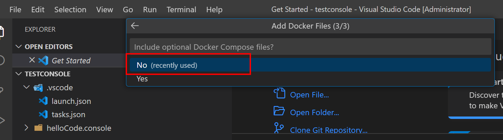

# Running .net console application on Azure container instance 

## Prerequisites 
* [Docker Desktop](https://www.docker.com/products/docker-desktop/) >> Sign in to docker desktop
* [.NET SDK](https://dotnet.microsoft.com/en-us/download/visual-studio-sdks)
* [VS.Code](https://code.visualstudio.com)
* VS Code extensions 
  * C# v1.25.2
  * Docker v1.23.2
  * vscode-icons v12.0.1
  * YAML v1.10.1
  
## Experiment 

1. Check docker and dot net version 

*Docker Version*
```shell
docker --version 
```
> output :
> Docker version 20.10.17, build 100c701

*dotnet sdk version*
```shell
dotnet --version 
```
> output :
> 7.0.101

### Create console app to run in docker 
1. Create .net application using vs code

*Get supported project templates*
```shell
dotnet new 
```
*Create new console project*
```shell
# dotnet new <short name> -n <project name> -o <project folder>
dotnet new console -n helloConsole -o helloCode.console
```
*Open project in vs code*
```shell
code .
```
2. Update code
``` cSharp
// See https://aka.ms/new-console-template for more information
Console.WriteLine("Hello, World!");

var counter = 0;
var max = args.Length != 0 ? Convert.ToInt32(args[0]) : -1;
while (max == -1 || counter < max)
{
    Console.WriteLine($"Counter: {++counter}");
    await Task.Delay(TimeSpan.FromMilliseconds(1_000));
}
```
3. Add debugging files 
   * "Run and Debug" extension >> "create a launch.json file > .NET 5+ and .NET Core"

   * "Run and Debug" extension >> .NET Core Launch 
  
4. Add docker support using docker extension 
   * Ctrl+Shift+P >> Add docker file..
  
   * Select project type 
   * Select OS 
   * No docker compose (single service) 

   * Docker file is created 

Docker file 
```yaml
FROM mcr.microsoft.com/dotnet/runtime:6.0 AS base
WORKDIR /app

FROM mcr.microsoft.com/dotnet/sdk:6.0 AS build
WORKDIR /src
COPY ["App/DotNet.Docker~.csproj", "App/"]
RUN dotnet restore "App\DotNet.Docker~.csproj"
COPY . .
WORKDIR "/src/App"
RUN dotnet build "DotNet.Docker~.csproj" -c Release -o /app/build

FROM build AS publish
RUN dotnet publish "DotNet.Docker~.csproj" -c Release -o /app/publish /p:UseAppHost=false

FROM base AS final
WORKDIR /app
COPY --from=publish /app/publish .
ENTRYPOINT ["dotnet", "DotNet.Docker~.dll"]
```
5. Debug project in docker 
* "Run and Debug" extension >> "Docker .NET Core Launch


### Build and load image to registory 
1. Build a docker image with docker file in the current directory (.)
```shell
# Docker build –t [image name]:[version] -f [docker file location] [path]
image=helloconsole
ver=latest
docker build -t $image:$ver -f ./App/Dockerfile  .
```

2. Run project on docker desktop 
```shell
image=helloconsole
ver=latest

docker run $image 5
```

3. Tag local docker image so it can be pushed to docker registry 
```shell
#docker tag SOURCE_IMAGE[:TAG] TARGET_IMAGE[:TAG]
registry=tkwuscr
#repo=tk
image=helloconsole
ver=latest
#docker tag $image:latest $registry.azurecr.io/$repo/$image:$ver
docker tag $image:latest $registry.azurecr.io/$image:$ver
```

4. Log in to container registry 
```shell
registry=tkwuscr
un=tkwuscr  # Becuase --admin-enabled true
pw=WbpzAGPQvRaYFmFcjdpj9gWYRRiMXagjRCzVCY+4v4+ACRCu7vLu # admin access key
docker login $registry.azurecr.io -u $un -p $pw
```

5. Push image to registry 
```shell
# docker push [docker registry name]/[repo name]/[Image name]:[version]
registry=tkwuscr
#repo=tk
image=helloconsole
ver=latest
docker push $registry.azurecr.io/$image:$ver
```

### Create az container instance using logic app image
REf:https://github.com/Azure-Samples/aci-logicapps-integration 
https://soltisweb.com/blog/detail/2021-09-01-deployinganimagefromazurecontainerregistrytoazurelogicapps
1. Create logic app with managed identity 
2. 

### Create az container instance using az CLI from image
1. log in to Azure 
```shell
az login
```

2. Set context to correct subscription
```shell
sub=708854ac-164b-4d34-a0b9-69ff53d7704d
az account set -s $sub

az account list -o table
```

3. Create container instance from image ([using az CLI](https://learn.microsoft.com/en-us/cli/azure/container?view=azure-cli-latest#az-container-create))
4. ```shell
rg=tkcr-rg
ci=helloconsole-ci
registry=tkwuscr
repo=tk
image=helloconsole
ver=latest
un=tkwuscr  # Becuase --admin-enabled true
pw=WbpzAGPQvRaYFmFcjdpj9gWYRRiMXagjRCzVCY+4v4+ACRCu7vLu # admin access key
az container create -g $rg  -n $ci \
--registry-login-server $registry.azurecr.io \
--registry-username $un \
--registry-password $pw \
--image $registry.azurecr.io/$repo/$image:$ver \
--cpu 1 --memory 1 --os-type Windows	  \
--dns-name-label $ci 

az container exec -g $rg  -n $ci --exec-command "cmd.exe"
```

# TO DO: Notes below are to do to include additional features 
### Add connection to SQL server 
1. Add nuget package listed below 
   * Microsoft.Extensions.Configuration
   * Microsoft.Extensions.Configuration.FileExtensions
   * Microsoft.Extensions.Configuration.Json
   * System.Data.SqlClient

2. Add connection string to app settings (appsettings.json)
```json
{
  "ConnectionStrings": {
    "Default": "Server=YOUR_SERVER;Database=mydatabase;User Id=YOUR_USER;Password=YOUR_PASSWORD;MultipleActiveResultSets=true"
  }
}  
```

1. Treate appsettings.json file as content and copy to output directory (file>> properties>> "Copy to output directory: Copy always)

2. Code to query database
   
  ```csharp
using System.Data;
using System.Data.SqlClient;
using Microsoft.Extensions.Configuration;

class Program
{
    public static async Task Main(string[] args)
    {
        var configuration = new ConfigurationBuilder()
            .SetBasePath(Directory.GetCurrentDirectory())
            .AddJsonFile("appsettings.json");
        var config = configuration.Build();

        var connstr = config.GetConnectionString("Default");

        QueryDatabase(connstr);
    }

    private static void QueryDatabase(string? connstr)
    {
        var conn = new SqlConnection();
        conn.ConnectionString = connstr;

        var cmd = conn.CreateCommand();
        cmd.CommandText = @"select top 10 	c.CustomerId AS ID,	c.Company AS CompanyName from Customer c with (nolock)";
        cmd.CommandType = CommandType.Text;
        //cmd.CommandTimeout = _commandTimeout;

        try
        {
            conn.Open();

            var reader = cmd.ExecuteReader();
            while (reader.Read())
            {
                Console.WriteLine($"ID {reader.GetGuid(0).ToString()} Company {reader.GetString(1)}");
            }
        }
        catch (Exception ex)
        {
            Console.WriteLine($"Error Message: {ex.Message}");
        }
        finally
        {
            conn.Close();
        }
    }
}
```


   
### Add logging

### Configuration 
1. Environment specific variables

2. Secrets (password, API Keys, connection string, license keys, ect.)
3. Runtime knobs (log levels, feature togals)

Layered configuration Order

1. appsettings.json: json-based text file
2. appsettings.<env>.json: based on ASPNETCORE_ENVIRONMENT
3. User secrets: Development-only
4. Environment variables (containers like env var --containers are immutable)
5. Command-line arguments


# Docker CLI commands

* [docker ps <first characters of container name>](https://docs.docker.com/engine/reference/commandline/ps/) >> list containers 
* [docker status <first characters of container name>](https://docs.docker.com/engine/reference/commandline/stats/) > Display a live stream of container(s) resource usage statistics
* [docker inspect <first characters of container name>](https://docs.docker.com/engine/reference/commandline/inspect/) > Return low-level information on Docker objects

# Refernece 
  * [Containerize a .NET app](https://learn.microsoft.com/en-us/dotnet/core/docker/build-container?tabs=windows)
  * [Docker CLI commands](https://docs.docker.com/engine/reference/commandline) 